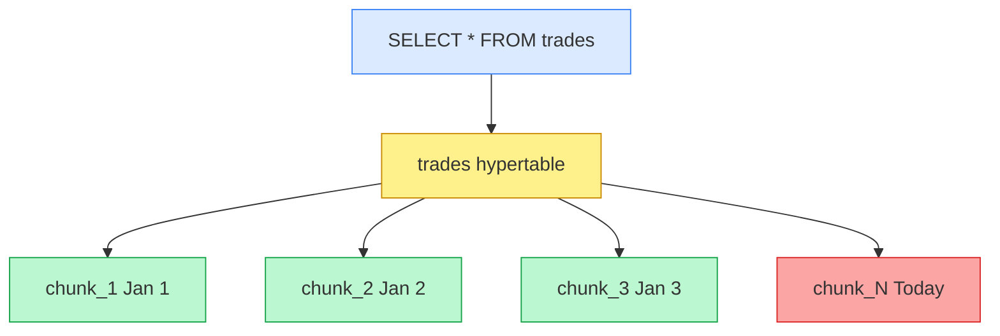
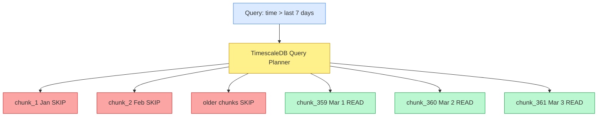
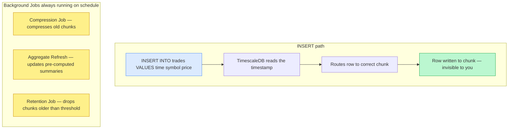
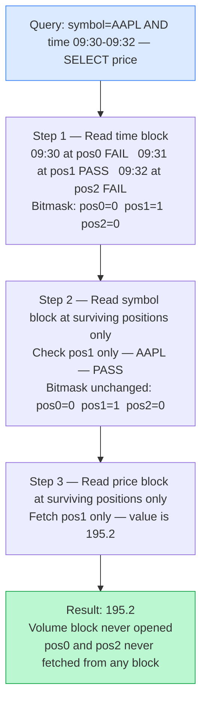
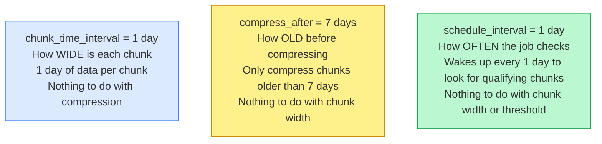
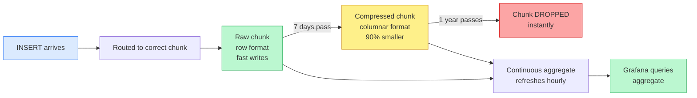
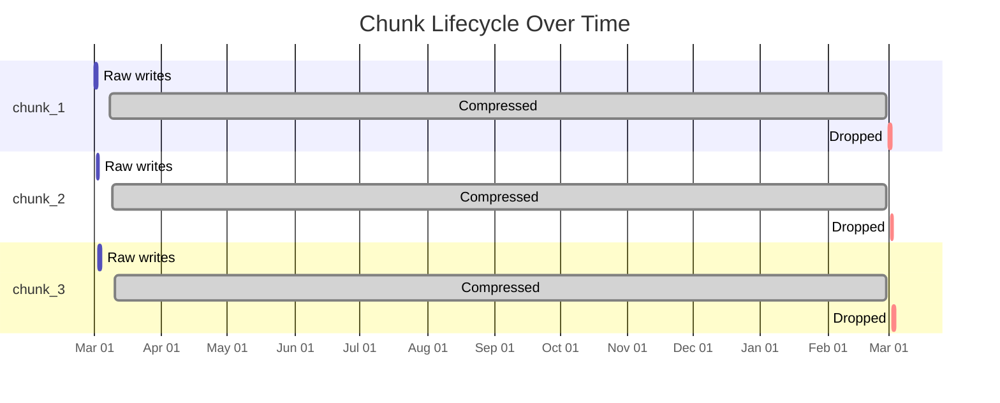

# TimescaleDB — Junior Engineer's Complete Guide

> Built from first principles. Every concept explained from scratch.
> Covers every "why", "what", and "how" a junior would ask.

---

## Table of Contents

1. [The Problem TimescaleDB Solves](#1-the-problem-timescaledb-solves)
2. [What Is TimescaleDB](#2-what-is-timescaledb)
3. [What Is Time Series Data](#3-what-is-time-series-data)
4. [What Is a Hypertable](#4-what-is-a-hypertable)
5. [What Is a Chunk](#5-what-is-a-chunk)
6. [Is TimescaleDB Only Active During Queries](#6-is-timescaledb-only-active-during-queries)
7. [What Is Compression](#7-what-is-compression)
8. [Row Format vs Columnar Format](#8-row-format-vs-columnar-format)
9. [How Queries Still Work After Compression](#9-how-queries-still-work-after-compression)
10. [The Three Compression Settings](#10-the-three-compression-settings)
11. [When Does Compression Actually Run](#11-when-does-compression-actually-run)
12. [What Are Continuous Aggregates](#12-what-are-continuous-aggregates)
13. [Docker Image](#13-docker-image)
14. [Putting It All Together — Full Setup](#14-putting-it-all-together--full-setup)
15. [The Complete Day-by-Day Lifecycle](#15-the-complete-day-by-day-lifecycle)
16. [When TimescaleDB Is the Wrong Tool](#16-when-timescaledb-is-the-wrong-tool)

---

## 1. The Problem TimescaleDB Solves

Imagine you join a stock trading company. On day 1 your manager says:

> "We store every price tick for 500 stocks. That's 10 million rows per day.
> After 6 months Grafana dashboards are timing out. Fix it."

You look at the database. It is vanilla PostgreSQL. One giant `trades` table. 1.8 billion rows. Every dashboard query scans the whole thing.

This is exactly the problem TimescaleDB was built for.

```
Vanilla PostgreSQL after 1 year:

SELECT avg(price) FROM trades WHERE time > now() - INTERVAL '7 days';

PostgreSQL:
  → Opens the ENTIRE trades table (1.8 billion rows)
  → Reads every single row from disk
  → Filters out 99.9% after reading them
  → Returns result

Like searching for last week's emails by reading
every email you ever sent since college.
```

---

## 2. What Is TimescaleDB

Not a replacement for PostgreSQL. Not a separate database.

```
TimescaleDB = PostgreSQL + an extension installed on top
```

Everything you know about Postgres still works:

| Works as before | New capabilities added |
|---|---|
| Same SQL | Hypertables (auto partitioning by time) |
| Same `psql` | Compression (columnar storage for old data) |
| Same `pg_dump` | Continuous Aggregates (auto-refreshing summaries) |
| Same Grafana datasource | Retention Policies (auto-delete old data) |
| Same indexes, JOINs | Background job scheduler |

Think of it like installing an app on your phone. The phone (PostgreSQL) works exactly the same. The app (TimescaleDB) adds new capabilities on top.

---

## 3. What Is Time Series Data

Time series data has three characteristics:

```
1. Every row has a timestamp
   trades: (2025-03-07 09:30:00, AAPL, 195.0, 1000)
                ↑ always present

2. Rows arrive in time order — mostly append-only
   You insert new prices. You rarely update old prices.
   "What was AAPL at 09:30 yesterday" never changes.

3. You almost always query by time range
   "Give me last 7 days"
   "Give me March data"
   "Give me last 1 hour"
```

Examples:

| Domain | Data | Frequency |
|---|---|---|
| Stock trading | Price ticks | Every millisecond |
| IoT | Sensor temperature | Every 5 seconds |
| DevOps | CPU/memory metrics | Every minute |
| Web analytics | User click events | Continuous |
| Weather | Station readings | Every hour |

---

## 4. What Is a Hypertable

A hypertable looks like one normal table to you. Behind the scenes TimescaleDB splits it into many small tables called **chunks**, each covering a specific time window.



**Why does this matter — Chunk Exclusion:**

```
Query: WHERE time > now() - INTERVAL '7 days'

Without hypertable (vanilla Postgres):
  Scans all 365 chunks worth of data

With hypertable (TimescaleDB):
  Opens only the last 7 chunks
  Skips 358 chunks entirely — never reads from disk

This is called CHUNK EXCLUSION.
```



---

## 5. What Is a Chunk

A chunk is a real, physical PostgreSQL table. You just never interact with it directly.

```sql
-- After create_hypertable, TimescaleDB creates under the hood:
_timescaledb_internal._hyper_1_1_chunk  -- chunk for day 1
_timescaledb_internal._hyper_1_2_chunk  -- chunk for day 2
_timescaledb_internal._hyper_1_3_chunk  -- chunk for day 3
-- ... one per day (or week, or hour — whatever you configured)
```

You can see your chunks at any time:

```sql
SELECT chunk_name,
       range_start,
       range_end,
       is_compressed
FROM timescaledb_information.chunks
WHERE hypertable_name = 'trades';

-- Output:
-- _hyper_1_1_chunk | 2025-03-01 | 2025-03-02 | false
-- _hyper_1_2_chunk | 2025-03-02 | 2025-03-03 | false
-- _hyper_1_3_chunk | 2025-03-03 | 2025-03-04 | true
```

**What does `chunk_time_interval => INTERVAL '1 day'` mean?**

Only one thing: **how wide is each chunk in time**.

```
'1 day'  → each chunk holds exactly 1 day of data
'1 week' → each chunk holds exactly 1 week of data
'1 hour' → each chunk holds exactly 1 hour of data

Has NOTHING to do with compression.
Has NOTHING to do with how often jobs run.
Only controls: how wide is each time window per chunk.
```

---

## 6. Is TimescaleDB Only Active During Queries?

**No. TimescaleDB is always working — not just during queries.**



| Activity | When | What TimescaleDB Does |
|---|---|---|
| Every INSERT | Always | Routes row to correct chunk by timestamp |
| SELECT with time filter | Query time | Skips chunks outside time range (fast) |
| SELECT without time filter | Query time | Scans all chunks (same as vanilla Postgres) |
| Compression job | Background schedule | Compresses old chunks |
| Aggregate refresh | Background schedule | Updates continuous aggregate summaries |
| Retention job | Background schedule | Drops chunks older than threshold |

---

## 7. What Is Compression

Old chunks stop receiving new data. TimescaleDB can compress them to save space and speed up reads.

```
Raw row format after 1 year:   15 GB
After compression on old data:  1.5 GB
Savings: 90%
```

Compression does two things:

```
1. Changes storage format: row → columnar
   Similar values stored together → much smaller on disk

2. Changes access pattern: read all columns → read only needed columns
   Query for price only → only price bytes read from disk
   Volume and symbol bytes never touched
```

---

## 8. Row Format vs Columnar Format

### Row Format — How All Databases Default

Data stored row by row on disk. To compute `avg(price)`, every field of every row must be read:

```
DISK (row format):

[09:30][AAPL][195.0][1000]  [09:31][AAPL][195.2][900]  [09:32][TSLA][250.0][800]
 ←──────── row 1 ─────────→  ←──────── row 2 ─────────→  ←──────── row 3 ─────────→

For avg(price): must read 12 values but only 3 are price. 75% of disk reads wasted.
```

### Columnar Format — After TimescaleDB Compression

Same column values stored together. To compute `avg(price)`, only the price block is read:

```
DISK (columnar format):

[09:30][09:31][09:32]   [AAPL][AAPL][TSLA]   [195.0][195.2][250.0]   [1000][900][800]
 ←── all times ───────   ←── all symbols ──   ←──── all prices ─────   ←─ all volumes

For avg(price):
  SKIP time block entirely
  SKIP symbol block entirely
  READ price block only
  SKIP volume block entirely
  → Read 3 values, all 3 useful. 0% waste.
```

### Why 90% Smaller

Similar values stored next to each other compress extremely well:

```
AAPL prices stored together: 195.0, 195.2, 195.1, 195.3, 195.0

Compression sees:
  Base:   195.0
  Deltas: +0.2, -0.1, +0.2, -0.3   ← tiny numbers, compresses hugely

In row format, 195.0 neighbors on disk are [AAPL] and [1000]
— completely different types, nothing to compress.
```

---

## 9. How Queries Still Work After Compression

When data is spread across column blocks, how does TimescaleDB know which price belongs to which row?

**The answer: position index.** Every column block stores values in the same order, so position 1 in the time block always corresponds to position 1 in the price block.

```
Position:      [0]      [1]      [2]

time block:  [09:30]  [09:31]  [09:32]
symbol block:[AAPL]   [AAPL]   [TSLA]
price block: [195.0]  [195.2]  [250.0]
volume block:[1000]   [900]    [800]

Position 0 = complete row: 09:30, AAPL, 195.0, 1000
Position 1 = complete row: 09:31, AAPL, 195.2, 900
Position 2 = complete row: 09:32, TSLA, 250.0, 800
```

### Query walkthrough: `WHERE symbol='AAPL' AND time BETWEEN 09:30 AND 09:32, SELECT price`



---

## 10. The Three Compression Settings

```sql
ALTER TABLE trades SET (
    timescaledb.compress,                        -- Setting 1
    timescaledb.compress_segmentby = 'symbol',   -- Setting 2
    timescaledb.compress_orderby   = 'time DESC' -- Setting 3
);
```

**Setting 1 — `timescaledb.compress`**

Just a flag. "Compression is allowed on this table." Does not compress anything yet. Without this TimescaleDB refuses to compress at all.

**Setting 2 — `compress_segmentby = 'symbol'`**

Before compressing, group rows by symbol first. Each symbol gets its own compressed block:

```
WITHOUT segmentby — one mixed block:
  [AAPL 195.0] [TSLA 250.0] [AAPL 195.2] [NVDA 880.0]
  AAPL query must scan all positions to find AAPL rows

WITH segmentby = 'symbol' — separate block per symbol:
  AAPL block: [195.0, 195.2, 195.1]
  TSLA block: [250.0, 250.5, 251.0]
  NVDA block: [880.0, 881.0]

  AAPL query opens AAPL block only.
  TSLA and NVDA blocks never touched, never decompressed.
```

**Setting 3 — `compress_orderby = 'time DESC'`**

Within each symbol group, sort rows newest first before compressing:

```
AAPL block sorted time DESC:
  pos 0 → 09:36  (newest)
  pos 1 → 09:33
  pos 2 → 09:31  (oldest)

Query: WHERE time > 09:33
  pos 0: 09:36 ✓ keep
  pos 1: 09:33 ✗ stop — sorted DESC so everything below is older

Finds result without scanning the full block.
```

---

## 11. When Does Compression Actually Run

**Compression does NOT run continuously. It runs on a schedule like a cron job.**

```
Timeline of one day:

00:00 ──────────────────────────────────── 24:00
  │
  │   Inserts happening all day normally
  │   No compression during this time
  │   Active chunk fully available for reads/writes
  │
02:00 → background job wakes up
        "Any chunks older than 7 days?"
        YES → compress them (takes minutes)
        NO  → go back to sleep until tomorrow

Next day 02:00 → wakes up again
```

The job lives inside TimescaleDB's own internal scheduler — no OS cron needed:

```sql
-- See the scheduled job TimescaleDB created automatically
SELECT job_id,
       application_name,
       schedule_interval,
       next_start,
       last_run_status
FROM timescaledb_information.jobs;

-- Change when it runs
SELECT alter_job(1000,
    next_start => '2025-03-08 02:00:00'
);
```

**Three completely separate settings — people always confuse these:**



---

## 12. What Are Continuous Aggregates

**The problem:**

Your Grafana dashboard shows hourly OHLCV charts. Every page load runs:

```sql
SELECT time_bucket('1 hour', time), avg(price)
FROM trades WHERE symbol = 'AAPL'
GROUP BY 1;
```

After 1 year this query scans millions of raw rows. Slow.

**The solution — pre-compute the summary once, refresh automatically:**

```sql
CREATE MATERIALIZED VIEW hourly_ohlcv
WITH (timescaledb.continuous) AS
SELECT
    time_bucket('1 hour', time) AS bucket,
    symbol,
    first(price, time) AS open,
    max(price)         AS high,
    min(price)         AS low,
    last(price, time)  AS close,
    sum(volume)        AS volume
FROM trades
GROUP BY bucket, symbol;

-- Auto-refresh every hour
SELECT add_continuous_aggregate_policy('hourly_ohlcv',
    start_offset      => INTERVAL '2 hours',
    end_offset        => INTERVAL '1 hour',
    schedule_interval => INTERVAL '1 hour'
);
```

**Why better than a regular Postgres materialized view:**

```mermaid
graph TD
    subgraph Postgres Materialized View — gets slower forever
        A1["Monday REFRESH — scans ALL 365 days — rebuilds from scratch"]
        A2["Tuesday REFRESH — scans ALL 365 days again — rebuilds from scratch"]
        A3["Wednesday REFRESH — scans ALL 365 days again — gets slower every day"]
        A1 --> A2 --> A3
    end

    subgraph TimescaleDB Continuous Aggregate — always fast
        B1["Monday — compute everything — watermark set to Mon 23:59"]
        B2["Tuesday refresh — process Tuesday new data only — watermark moves forward"]
        B3["Wednesday refresh — process Wednesday new data only — always fast"]
        B1 --> B2 --> B3
    end

    style A1 fill:#fca5a5,stroke:#dc2626
    style A2 fill:#fca5a5,stroke:#dc2626
    style A3 fill:#fca5a5,stroke:#dc2626
    style B1 fill:#bbf7d0,stroke:#16a34a
    style B2 fill:#bbf7d0,stroke:#16a34a
    style B3 fill:#bbf7d0,stroke:#16a34a
```

Grafana queries the aggregate (24 rows/day) instead of raw data (millions/day).

---

## 13. Docker Image

```bash
# Vanilla PostgreSQL — no TimescaleDB
docker pull postgres:16

# TimescaleDB — PostgreSQL 16 with extension pre-installed
docker pull timescale/timescaledb-ha:pg16

# Run with Podman
podman run -d --name timescaledb \
  -p 5432:5432 \
  -e POSTGRES_PASSWORD=secret \
  timescale/timescaledb-ha:pg16
```

The `-ha` image is PostgreSQL 16 with TimescaleDB already installed. Nothing is removed. All Postgres tools work normally.

After connecting, activate the extension per database — **once only:**

```sql
-- Run once per database. Safe to run again — IF NOT EXISTS means no error.
CREATE EXTENSION IF NOT EXISTS timescaledb;
```

Think of it like installing an app vs opening it:
- The image = app installed on your phone
- `CREATE EXTENSION` = you open/activate it in that specific database

---

## 14. Putting It All Together — Full Setup

```sql
-- Step 1: Create normal Postgres table
CREATE TABLE trades (
    time    TIMESTAMPTZ NOT NULL,
    symbol  TEXT        NOT NULL,
    price   NUMERIC     NOT NULL,
    volume  BIGINT
);

-- Step 2: Convert to hypertable
-- Each chunk = 1 day of data
SELECT create_hypertable('trades', 'time',
    chunk_time_interval => INTERVAL '1 day'
);

-- Step 3: Tell TimescaleDB HOW to compress (the recipe)
-- This does NOT compress anything yet — just configuration
ALTER TABLE trades SET (
    timescaledb.compress,
    timescaledb.compress_segmentby = 'symbol',
    timescaledb.compress_orderby   = 'time DESC'
);

-- Step 4: Schedule the compression job
-- Compress chunks older than 7 days
-- Background job checks every 1 day automatically
SELECT add_compression_policy('trades',
    compress_after => INTERVAL '7 days'
);

-- Step 5: Create hourly summary for dashboards
CREATE MATERIALIZED VIEW hourly_ohlcv
WITH (timescaledb.continuous) AS
SELECT
    time_bucket('1 hour', time) AS bucket,
    symbol,
    first(price, time) AS open,
    max(price)         AS high,
    min(price)         AS low,
    last(price, time)  AS close,
    sum(volume)        AS volume
FROM trades
GROUP BY bucket, symbol;

SELECT add_continuous_aggregate_policy('hourly_ohlcv',
    start_offset      => INTERVAL '2 hours',
    end_offset        => INTERVAL '1 hour',
    schedule_interval => INTERVAL '1 hour'
);

-- Step 6: Auto-delete data older than 1 year
SELECT add_retention_policy('trades',
    drop_after => INTERVAL '1 year'
);
```

After this setup — **you just use it like a normal table forever:**

```sql
-- Normal insert — TimescaleDB routes to correct chunk automatically
INSERT INTO trades VALUES (now(), 'AAPL', 195.0, 1000);

-- Normal query — chunk exclusion skips old chunks automatically
SELECT avg(price) FROM trades
WHERE symbol = 'AAPL'
AND time > now() - INTERVAL '30 days';

-- Dashboard query — hits pre-computed aggregate, not raw data
SELECT bucket, open, high, low, close, volume
FROM hourly_ohlcv
WHERE symbol = 'AAPL'
AND bucket > now() - INTERVAL '7 days';
```

---

## 15. The Complete Day-by-Day Lifecycle

```
Day 1-7: Chunks filling up with raw data

Mar 1      Mar 2      Mar 3      Mar 4      Mar 5      Mar 6      Mar 7
[chunk_1]  [chunk_2]  [chunk_3]  [chunk_4]  [chunk_5]  [chunk_6]  [chunk_7]
  raw        raw        raw        raw        raw        raw        raw ← active

Day 8: Background compression job wakes up at 02:00

  chunk_1 = 8 days old → YES → compress ✓
  chunk_2 = 7 days old → borderline → skip
  chunk_3 to chunk_8   → too recent → skip

Mar 1      Mar 2      Mar 3  ...  Mar 8
[chunk_1]  [chunk_2]  [chunk_3]  [chunk_8]
compressed   raw        raw        raw ← active

Day 9: Job wakes up again
  chunk_1 = already compressed → skip
  chunk_2 = 8 days old → compress ✓
  ...and so on, one chunk compressed per day

Day 365: Retention job wakes up
  chunk_1 = 365 days old → DROP instantly
  Dropping a chunk = dropping one table = near-instant
  No row-by-row DELETE scan
```

**Full lifecycle — from INSERT to DROP:**



**Chunk compression timeline over a year:**



---

## 16. When TimescaleDB Is the Wrong Tool

```
USE TimescaleDB when:                   AVOID when:
─────────────────────────────           ──────────────────────────────
Data always has a timestamp             Data has no time component
Mostly INSERT, rarely UPDATE            Frequently update historical rows
Query mostly by time range              Random access patterns
Data grows forever                      Fixed or small dataset
Need storage savings on old data        Storage is not a concern
Grafana dashboards on metrics           General purpose OLTP application
IoT / trading / monitoring              Transactional app (orders, users)
```

**The critical limitation — updates on compressed data:**

```sql
-- Vanilla Postgres: instant
UPDATE trades SET price = 195.5 WHERE time = '09:31' AND symbol = 'AAPL';

-- TimescaleDB compressed chunk: expensive
-- 1. Decompress the entire AAPL segment
-- 2. Update the one row
-- 3. Recompress the entire AAPL segment
-- 4. Write back to disk
-- Much slower, much more disk I/O
```

TimescaleDB is designed for **append-only** workloads. Historical data does not change. New data keeps arriving. This matches perfectly with: stock ticks, sensor readings, server metrics, event logs.

---

## Summary — Three Settings You Must Never Confuse

```
chunk_time_interval = '1 day'
  → How WIDE is each chunk
  → 1 day of data per chunk
  → Nothing to do with compression

compress_after = '7 days'
  → How OLD must a chunk be before compressing
  → Nothing to do with chunk width

schedule_interval = '1 day'
  → How OFTEN the compression job wakes up and checks
  → Nothing to do with chunk width or compression threshold
```

These three independent settings work together to give you:

```
Recent data   → raw chunks    → fast inserts, fast recent queries
Old data      → compressed    → 90% smaller, fast analytical reads
Very old data → dropped       → storage stays bounded forever
Dashboards    → aggregates    → pre-computed, instant response
```
